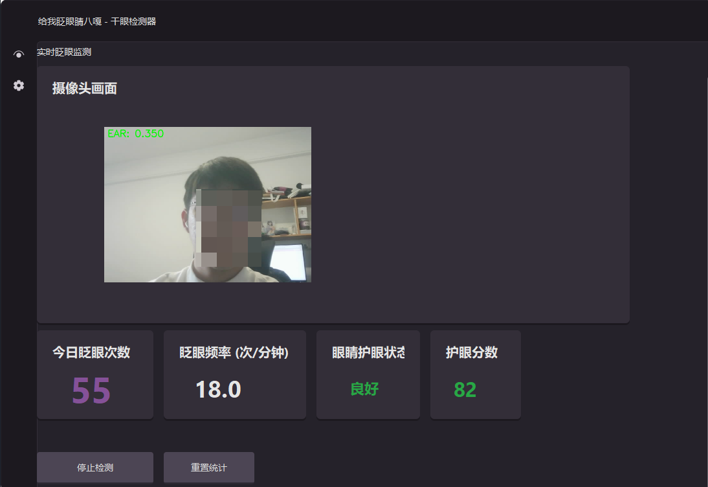
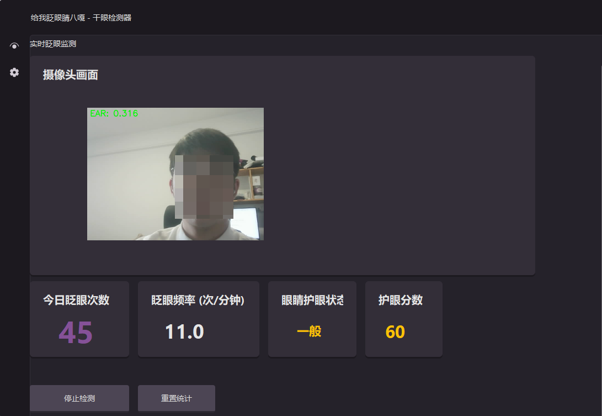
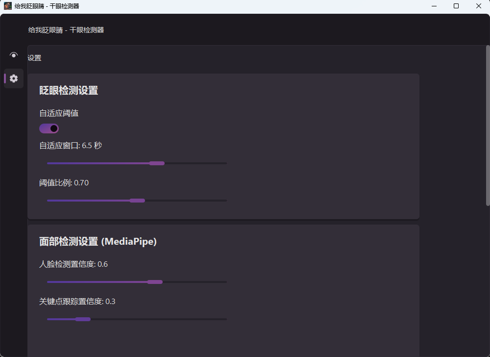

# 给我眨眼睛 - 干眼检测器

一个基于Python的干眼症防护应用，通过摄像头实时监测眨眼情况，分析眨眼频率来评估眼睛护眼状态，并在眨眼频率过低时提醒用户多眨眼保护眼睛。

## 功能特点

- **眨眼检测**：使用EAR（眼睛纵横比）算法实时检测眨眼
- **眨眼频率统计**：统计每分钟眨眼次数，评估护眼状态
- **护眼状态评估**：基于眨眼频率评估护眼状态（优秀/良好/一般/需注意/提醒）
- **智能提醒**：当眨眼频率过低时，通过系统通知提醒用户多眨眼
- **实时统计**：显示实时眨眼次数、频率、EAR值等数据
- **SiliconUI界面**：使用现代化的SiliconUI界面

## 界面预览

| 页面           | 说明                                             | 预览图                        |
| -------------- | ------------------------------------------------ | ----------------------------- |
| good 状态页    | 眨眼频率正常/优秀时的护眼状态界面                |     |
| warning 状态页 | 眨眼频率偏低/不足时的护眼状态界面                |  |
| 设置页         | 眨眼检测参数、面部检测设置、提醒设置、摄像头设置 |      |

## 部署方式

本项目依赖较多，建议使用 **Conda** 创建独立环境，避免与系统现有 Python 环境冲突。

### 1. 创建 Conda 环境

```bash
# 创建并激活环境
conda create -n dry_eye_env python=3.10
conda activate dry_eye_env
```

### 2. 安装依赖

```bash
pip install -r requirements.txt
```

### 3. 运行程序

```bash
python main.py
```

## 主要依赖

- PyQt5 - GUI框架
- SiUI (PyQt-SiliconUI) - 现代化UI库
- opencv-python - 图像处理
- mediapipe - 面部关键点检测
- numpy, scipy - 科学计算
- win10toast - Windows系统通知

## 使用方法

1. 运行程序：

```bash
python main.py
```

2. 点击"开始检测"按钮启动摄像头和检测
2. 程序会：
  - 实时显示摄像头画面
  - 监测眨眼情况
  - 计算眨眼频率
  - 显示实时统计数据
  - 评估护眼状态
3. 当眨眼频率过低时，会弹出系统通知提醒您多眨眼

## 配置说明

在设置页面可以调整以下参数：

- **EAR阈值**：眼睛闭合的EAR判断阈值（默认0.21）
- **眨眼持续时间**：判定为有效眨眼的最短时间
- **统计窗口**：眨眼频率统计的时间窗口大小
- **频率提醒下限**：低于此频率时发出提醒（默认5次/分钟）
- **提醒间隔**：两次提醒之间的最小间隔

## 项目结构

```
├── main.py                    # 程序入口
├── dry_eye_detector_ui.py     # 主界面程序
├── camera_manager.py          # 摄像头管理器
├── eye_blink_detector.py      # EAR眨眼检测模块
├── perclos_calculator.py      # 护眼分析模块（用于显示）
├── config_manager.py          # 配置管理模块
├── alert_thread.py            # 提醒线程（音频播放/系统通知）
├── config.json                # 配置文件
├── img/                       # 图片资源目录
├── dry_eye.spec               # PyInstaller打包配置
├── requirements.txt           # Python依赖列表
└── README.md                  # 本文件
```

## 算法说明

### EAR (Eye Aspect Ratio)

EAR是一种用于检测眼睛开合程度的方法。计算眼睛六个关键点的纵横比：

- 当眼睛睁开时，EAR值较高（通常 > 0.21）
- 当眼睛闭合时，EAR值较低

### 自适应动态阈值检测

本项目引入了**自适应动态阈值检测**机制，解决固定阈值在不同光照、不同用户、不同摄像头下泛化性差的问题。

**核心原理**：不依赖人工设定的固定 EAR 阈值，而是根据用户最近一段时间内的 EAR 分布自动计算：

```
动态阈值 = 窗口内最大EAR × threshold_ratio
```

其中 `threshold_ratio`（默认 0.7）控制阈值在最大 EAR 中的占比。

**滑动窗口**：以最近 N 秒（默认 6.5s）的 EAR 值构建滑动窗口，仅用窗口内数据计算，使阈值能够跟随用户状态实时变化。

**边界约束**：动态阈值会被限制在 `[0.15, 0.40]` 范围内，防止极端值干扰判断。

**优势**：无需手动调参，在各种光照环境和人脸角度下均能保持稳定检测精度。

### 眨眼频率

眨眼频率是评估护眼状态的核心指标：

- **优秀**（>=25次/分钟）：眨眼频率很高，护眼状态优秀
- **良好**（>=15次/分钟）：眨眼频率正常，护眼状态良好
- **一般**（>=8次/分钟）：眨眼频率偏低，建议多眨眼
- **需注意**（>=5次/分钟）：眨眼频率过低，建议休息眨眼
- **提醒**（<5次/分钟）：眨眼频率严重不足，请立即眨眼休息

## 注意事项

1. 确保摄像头可用且光线充足
2. 建议保持面部在摄像头画面中心
3. 程序需要持续运行以准确计算统计数据
4. 眨眼频率高说明护眼状态好

## 致谢

本项目的 UI 界面基于 **[PyQt-SiliconUI](https://github.com/TheKingOfPython001/pyqt-siliconui)** 开发，感谢其提供的现代化 Qt 组件库。

本项目使用 **[MediaPipe](https://google.github.io/mediapipe/)** 进行面部关键点检测，支撑眨眼识别算法。

